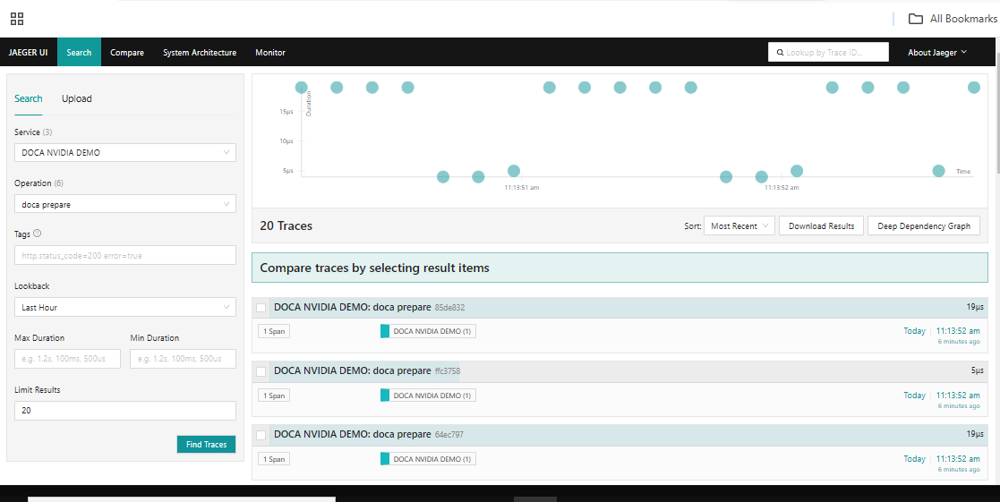

# OpenTelemetry C++ Starter for DOCA

## Prerequisites

Ensure you have the following installed:

- **Git**
- **C++ Compiler**
- **Make**
- **CMake**
- **Docker** (for running the OTLP collector and Jeager)

### Create Project Directory

Create a folder named otel-cpp-starter.

move into the newly created folder. This will serve as your working directory.

```bash
mkdir otel-cpp-starter
cd otel-cpp-starter
```

Next, install and build OpenTelemetry C++ locally using CMake, following these steps:

In your terminal, navigate back to the otel-cpp-starter directory. Then, clone the OpenTelemetry C++ GitHub repository to your local machine.

```bash
git clone https://github.com/open-telemetry/opentelemetry-cpp.git
```

Change your working directory to the OpenTelemetry C++ SDK directory.

```bash
cd opentelemetry-cpp
```

Create a build directory and navigate into it.

```bash
mkdir build
cd build
```

In the build directory run CMake, to configure and generate the build system without enabling tests:

```bash
cmake -DBUILD_TESTING=OFF ..
Or, if the cmake --build fails, you can also try:

cmake -DBUILD_TESTING=OFF -DWITH_ABSEIL=ON ..
Execute the build process:

cmake --build .
Install OpenTelemetry C++ in otel-cpp-starter/otel-cpp:

cmake --install . --prefix ../../otel-cpp
```

## Traces

### Initialize tracing

```bash
auto provider = opentelemetry::trace::Provider::GetTracerProvider();
auto tracer = provider->GetTracer("foo_library", "1.0.0");
```

The TracerProvider acquired in the first step is a singleton object that is usually provided by the OpenTelemetry C++ SDK. It is used to provide specific implementations for API interfaces. In case no SDK is used, the API provides a default no-op implementation of a TracerProvider.

The Tracer acquired in the second step is needed to create and start Spans.

#### Start a span

```bash
auto span = tracer->StartSpan("HandleRequest");
```

This creates a span, sets its name to "HandleRequest", and sets its start time to the current time. Refer to the API documentation for other operations that are available to enrich spans with additional data.

#### Mark a span as active

```bash
auto scope = tracer->WithActiveSpan(span);
```

This marks a span as active and returns a Scope object. The scope object controls how long a span is active. The span remains active for the lifetime of the scope object.

The concept of an active span is important, as any span that is created without explicitly specifying a parent is parented to the currently active span. A span without a parent is called root span.

## Exporters

### Available exporters

The registry contains a list of exporters for C++.

Among exporters, OpenTelemetry Protocol (OTLP) exporters are designed with the OpenTelemetry data model in mind, emitting OTel data without any loss of information. Furthermore, many tools that operate on telemetry data support OTLP (such as Prometheus, Jaeger, and most vendors), providing you with a high degree of flexibility when you need it. To learn more about OTLP, see OTLP Specification.

This page covers the main OpenTelemetry C++ exporters and how to set them up.

## OTLP Exporter

### Collector Setup

In an empty directory, create a file called collector-config.yaml with the following content:

```yaml
receivers:
  otlp:
    protocols:
      grpc:
        endpoint: 0.0.0.0:4317
      http:
        endpoint: 0.0.0.0:4318
exporters:
  debug:
    verbosity: detailed
service:
  pipelines:
    traces:
      receivers: [otlp]
      exporters: [debug]
    metrics:
      receivers: [otlp]
      exporters: [debug]
    logs:
      receivers: [otlp]
      exporters: [debug]
```

Now run the collector in a docker container:

```bash
docker run -p 4317:4317 -p 4318:4318 --rm -v $(pwd)/collector-config.yaml:/etc/otelcol/config.yaml otel/opentelemetry-collector
```

This collector is now able to accept telemetry via OTLP. Later you may want to configure the collector to send your telemetry to your observability backend.

#### Dependencies

If you want to send telemetry data to an OTLP endpoint (like the OpenTelemetry Collector, Jaeger or Prometheus), you can choose between two different protocols to transport your data:

HTTP/protobuf
gRPC
Make sure that you have set the right cmake build variables while building OpenTelemetry C++ from source:

```bash
-DWITH_OTLP_GRPC=ON: To enable building OTLP gRPC exporter.
-DWITH_OTLP_HTTP=ON: To enable building OTLP HTTP exporter.
```

In this tutorial, we use HTTP endpoint.

## Usage

```bash
#include "opentelemetry/exporters/otlp/otlp_http_exporter_factory.h"
#include "opentelemetry/exporters/otlp/otlp_http_exporter_options.h"
#include "opentelemetry/sdk/trace/processor.h"
#include "opentelemetry/sdk/trace/batch_span_processor_factory.h"
#include "opentelemetry/sdk/trace/batch_span_processor_options.h"
#include "opentelemetry/sdk/trace/tracer_provider_factory.h"
#include "opentelemetry/trace/provider.h"
#include "opentelemetry/sdk/trace/tracer_provider.h"

#include "opentelemetry/exporters/otlp/otlp_http_metric_exporter_factory.h"
#include "opentelemetry/exporters/otlp/otlp_http_metric_exporter_options.h"
#include "opentelemetry/metrics/provider.h"
#include "opentelemetry/sdk/metrics/aggregation/default_aggregation.h"
#include "opentelemetry/sdk/metrics/export/periodic_exporting_metric_reader.h"
#include "opentelemetry/sdk/metrics/export/periodic_exporting_metric_reader_factory.h"
#include "opentelemetry/sdk/metrics/meter_context_factory.h"
#include "opentelemetry/sdk/metrics/meter_provider.h"
#include "opentelemetry/sdk/metrics/meter_provider_factory.h"

#include "opentelemetry/exporters/otlp/otlp_http_log_record_exporter_factory.h"
#include "opentelemetry/exporters/otlp/otlp_http_log_record_exporter_options.h"
#include "opentelemetry/logs/provider.h"
#include "opentelemetry/sdk/logs/logger_provider_factory.h"
#include "opentelemetry/sdk/logs/processor.h"
#include "opentelemetry/sdk/logs/simple_log_record_processor_factory.h"

namespace trace_api = opentelemetry::trace;
namespace trace_sdk = opentelemetry::sdk::trace;

namespace metric_sdk = opentelemetry::sdk::metrics;
namespace metrics_api = opentelemetry::metrics;

namespace otlp = opentelemetry::exporter::otlp;

namespace logs_api = opentelemetry::logs;
namespace logs_sdk = opentelemetry::sdk::logs;


void InitTracer()
    {
        // Create an OpenTelemetry Protocol (OTLP) exporter.
        auto exporter  = otlp::OtlpHttpExporterFactory::Create(opts);
        auto processor = trace_sdk::SimpleSpanProcessorFactory::Create(std::move(exporter));

        resource::ResourceAttributes attributes = {
                {resource::SemanticConventions::kServiceName, "DOCA NVIDIA DEMO"}, // The application name.
                {resource::SemanticConventions::kHostName, "$"}
        };
        auto resource = opentelemetry::sdk::resource::Resource::Create(attributes);

        std::shared_ptr<opentelemetry::trace::TracerProvider> provider =
                trace_sdk::TracerProviderFactory::Create(std::move(processor), std::move(resource));

        // Set the trace provider.
        trace::Provider::SetTracerProvider(provider);
    }
void CleanupTracer()
{
  std::shared_ptr<opentelemetry::trace::TracerProvider> none;
  trace::Provider::SetTracerProvider(none);
}
```

and then we define our function traces and we pass the service name and operation name on to it.

```bash
void traces(std::string serviceName, std::string operationName)
{
    auto span = getTracer(serviceName)->StartSpan(operationName);

    span->SetAttribute("service.name", serviceName);

    span->End();
}
```

we call it by using the traces and can pass the service and operation names respectively

```bash
 traces("doca", "doca prepare");
```

The traces are called and it send the traces to otlp endpoint.

After that, by using otlp the traces is sent to the jeager and it can be accessed on http...

The Build steps are as follows,

```bash
meson build
cd build
./doca_telemetry_export
```

make sure to run the docker containers for otel and jeager before executing above commands.

the will display on browser on [Jeager](https://localhost:16686)


